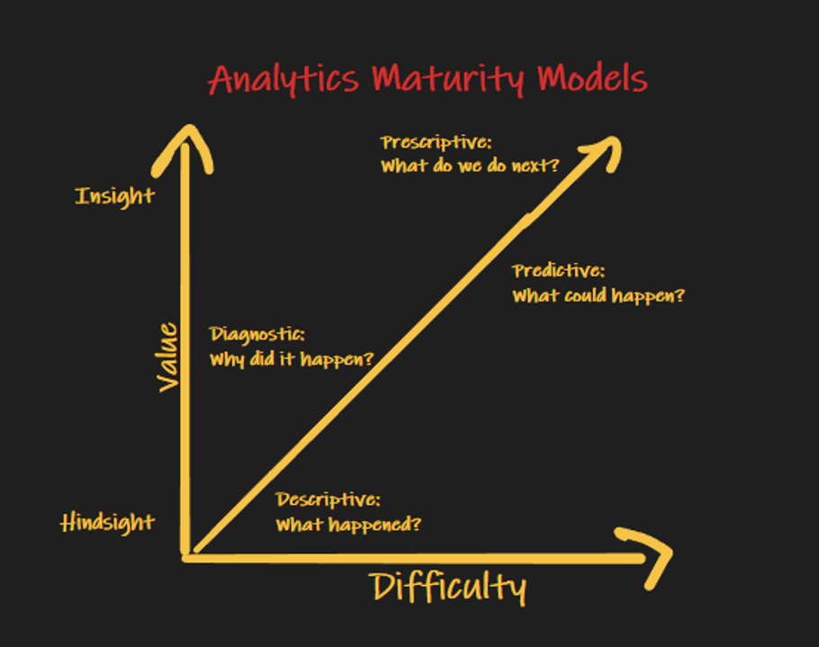

    
<h1 style="color:red;"><strong>Marketing Analytics Using Demand Signal Repositories</strong></h1>

  
Dave Wentzel  

Philadelphia Microsoft Technology Center  

Contact Information:  [LinkedIn](https://linkedin.com/in/dwentzel)  
[Presentation](./MarketingAnalytics.pdf)

# Why are we here?

In my experience, marketers are the biggest analytics consumers in the typical company.  Every company wants to be more _data-driven_ or _insights-driven_, especially marketing teams.  But companies struggle with data...finding it, clean it, analyzing it, and using it to form opinions that provide _lift_.  

Because of this, most marketing analytics is still done in Excel.  The reason is simple:  **Your marketing team wants to do complex analytics, but it’s too cumbersome to do in your data warehouse or existing systems.**  There’s a better way.  Data analysts need to be able to guide their marketing teams using Prescriptive Analytics techniques to show them “what do we do next”.  In this session we’ll look at how to enable marketing teams to do “self-service analytics” (with the data team’s guidance) by looking at real marketing use cases. We want to show you how to build a Demand Signal Repository that goes viral inside your organization.   

I have no new insights into marketing analytics, but I think I have a unique method that you can use to think about how to use data profitably in your company.  We'll use marketing business use cases today to demonstrate the approaches I use to analyze data.  

I call this **Prescriptive Analytics**.  It is a _process_, more than a set of tools, that is tailored to specific sets of personas (business analysts, business leaders, data engineers, and data scientists).  The process allows all of the personas to work together to improve the quality, reduce the risk, and improve the _time-to-insights_ of our analytics efforts.  The process includes:

* Design Thinking:  all personas working together to curate, interpret, and make opinions about data rapidly in an empathetic manner.  
* _Lean_ Principles:  we build rapid prototypes and seek constant feedback on our efforts.  We embrace failure and learn from it.  
* Modern analytics tooling that is geared to specific personas that fosters collaboration.  This includes:
  * SQL (every business analyst should understand a _modicum_ of SQL).  
    * We will use `Synapse SQL Serverless` but we could use _any_ SQL tool that supports a SQL abstraction over files in a data lake.  `Databricks` is an excellent choice.  
  * python/notebooks/Spark (data professionals use these tools but they are within the grasp of any business analyst)
  * Demand Signal Repositories:  that sounds really cool, but it's simply a data sandbox where we can collect disparate data about our customers, products, and marketing efforts.  We can quickly share the data, semantically-enrich it, and collaboratively analyze it.  A `Demand Signal Repository` is nothing more than a `data lake`.  

The **technology** is much less interesting than understanding a simple repeatable **process** to perform analytics that will actually _work_ for your **people** and their capabilities.  

> You do NOT need to be a python expert or understand advanced SQL.  What I will present is merely the thought processes that will help you on your analytics journey.  I switch between python and SQL a lot -- that is by design -- I choose the best tool for _me_ to accomplish a task, but you could use whatever YOU are comfortable with.  By using different tools in a collaborative manner you will hopefully see how everyone can collborate _prescriptively_.  The MTC is here to help.  

I consider _marketing analytics_ to be part of what I call **Prescriptive Analytics**.  This means that the analytics we do are far more advanced than just _predictive_ or _descriptive_ (machine learning and basic BI reporting).  We want to provide our business with ideas regarding _What do we do next?_.  

emeralds at qVC being returned
ebay resellers
indulgers

# Today's Use Cases

We can't cover every marketing analytics use case.  Instead, let's cover a few use cases that are focused on marketing, but have themes that are applicable to _many_ different business problems.  

## Social Media Campaign Analytics ...or...Making Cognitive Mistakes with Data

Marketers love to do surveys and interpret the results to determine _what do we do next?_.  The average marketer has forgotten more about surveys than I'll ever hope to learn, but the problem is that marketers, and frankly most business people, **do not understand how to interpret data without making cognitive mistakes**.  

This is a fun example of _Prescriptive Analytics_.  We are going to make recommendations on _Next Best Action_ based on the interpretation of a dataset.  

[Jupyter Notebook](./SocialMediaCampaignAnalytics.ipynb)

pdfs

Lead Scoring  https://towardsdatascience.com/saving-the-scranton-branch-with-lead-scoring-8599ed4a874f

CLV

correlationcausation.xls

Market segmentation, also called customer profiling,

Inclusions in emeralds
Ebay resellers:  buy a lot and then return a lot
	We want these customers to churn
